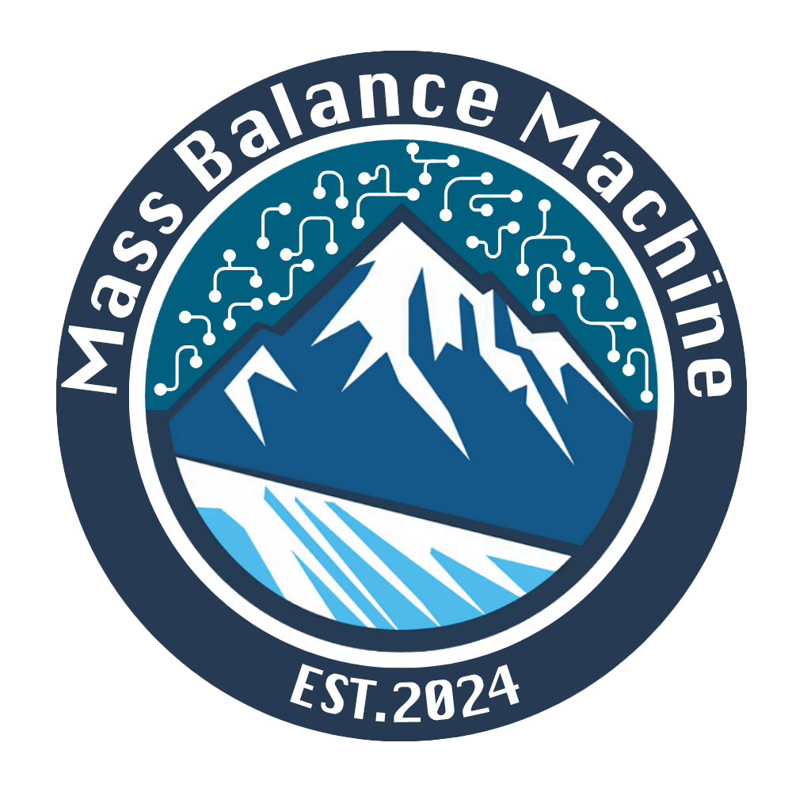

 

  

# MassBalanceMachine

A bridge between mass balance modelling and observations. Global machine learning glacier mass balance modelling that assimilates all glaciological and remote sensing data sources.

- 🏔️ MassBalanceMachine takes meteorological, topographical and/or other features to predict the surface mass balance of glaciers for a region of interest.
- ❄️ MassBalanceMachine uses glaciological (stake) and geodetic mass balance data as targets.
- 📅 MassBalanceMachine can make predictions or fill data gaps on an annual, seasonal (summer and winter), and monthly temporal scale for any spatial resolution.

> [!IMPORTANT]  
> This project is in **ongoing development**, and new features will be added over the coming months. Please see the [contribution guidelines](#contribution-guidelines) for more information on contributing to this project.

## Installation

Please refer to the [installation instructions](https://massbalancemachine.readthedocs.io/en/latest/install.html) of the documentation.

## Contributors

<!-- ALL-CONTRIBUTORS-LIST:START - Do not remove or modify this section -->
<!-- prettier-ignore-start -->
<!-- markdownlint-disable -->
<table>
  <tbody>
    <tr>
      <td align="center" valign="top" width="14.28%"><a href="https://github.com/khsjursen"> <b>khsjursen</b></a> <a href="#research-khsjursen" title="Research">🔬</a> <a href="#code-khsjursen" title="Code">💻</a> <a href="#ideas-khsjursen" title="Ideas, Planning, & Feedback">🤔</a> <a href="#data-khsjursen" title="Data">🔣</a></td>
      <td align="center" valign="top" width="14.28%"><a href="https://jordibolibar.wordpress.com"> <b>Jordi Bolibar</b></a> <a href="#research-JordiBolibar" title="Research">🔬</a> <a href="#projectManagement-JordiBolibar" title="Project Management">📆</a> <a href="#financial-JordiBolibar" title="Financial">💵</a> <a href="#ideas-JordiBolibar" title="Ideas, Planning, & Feedback">🤔</a> <a href="#mentoring-JordiBolibar" title="Mentoring">🧑‍🏫</a></td>
      <td align="center" valign="top" width="14.28%"><a href="https://github.com/marvande"> <b>Marijn  </b></a> <a href="#ideas-marvande" title="Ideas, Planning, & Feedback">🤔</a> <a href="#data-marvande" title="Data">🔣</a> <a href="#research-marvande" title="Research">🔬</a> <a href="#code-marvande" title="Code">💻</a> <a href="#maintenance-marvande" title="Maintenance">🚧</a></td>
      <td align="center" valign="top" width="14.28%"><a href="https://github.com/zekollari"> <b>zekollari</b></a> <a href="#research-zekollari" title="Research">🔬</a> <a href="#financial-zekollari" title="Financial">💵</a> <a href="#ideas-zekollari" title="Ideas, Planning, & Feedback">🤔</a> <a href="#mentoring-zekollari" title="Mentoring">🧑‍🏫</a></td>
      <td align="center" valign="top" width="14.28%"><a href="https://albangossard.github.io/"> <b>Alban Gossard</b></a> <a href="#code-albangossard" title="Code">💻</a> <a href="#research-albangossard" title="Research">🔬</a> <a href="#maintenance-albangossard" title="Maintenance">🚧</a> <a href="#doc-albangossard" title="Documentation">📖</a></td>
      <td align="center" valign="top" width="14.28%"><a href="https://github.com/JulianBiesheuvel"> <b>Julian</b></a> <a href="#code-JulianBiesheuvel" title="Code">💻</a> <a href="#doc-JulianBiesheuvel" title="Documentation">📖</a><a href="#data-JulianBiesheuvel" title="Data">🔣</a> <a href="#research-JulianBiesheuvel" title="Research">🔬</a></td>
    </tr>
  </tbody>
</table>

<!-- markdownlint-restore -->
<!-- prettier-ignore-end -->

<!-- ALL-CONTRIBUTORS-LIST:END -->

## Support

For support and assistance, please refer to the [support](https://massbalancemachine.readthedocs.io/en/latest/support.html) page of the documentation.
